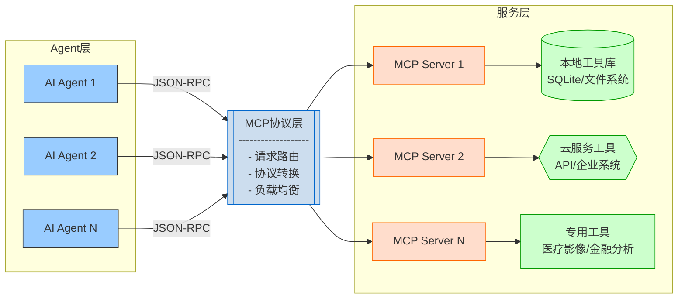

```mermaid
graph LR

    subgraph Agent层
        Agent1[AI Agent 1]
        Agent2[AI Agent 2]
        AgentN[AI Agent N]
    end

    MCP_Protocol[[MCP协议层
    -------------------
    - 请求路由
    - 协议转换
    - 负载均衡]]

    Agent1 -->|JSON-RPC| MCP_Protocol
    Agent2 -->|JSON-RPC| MCP_Protocol
    AgentN -->|JSON-RPC| MCP_Protocol

    subgraph 服务层
        Server1[MCP Server 1]
        Server2[MCP Server 2]
        ServerN[MCP Server N]
        
        Server1 --> Tool1[(本地工具库<br>SQLite/文件系统)]
        Server2 --> Tool2{{云服务工具<br>API/企业系统}}
        ServerN --> ToolN[专用工具<br>医疗影像/金融分析]
    end
    MCP_Protocol --> Server1
    MCP_Protocol --> Server2
    MCP_Protocol --> ServerN

    classDef agent fill:#9cf,stroke:#333;
    classDef protocol fill:#cde,stroke:#06c;
    classDef server fill:#fdc,stroke:#f60;
    classDef tool fill:#cfc,stroke:#090;
    class Agent1,Agent2,AgentN agent
    class MCP_Protocol protocol
    class Server1,Server2,ServerN server
    class Tool1,Tool2,ToolN tool

```